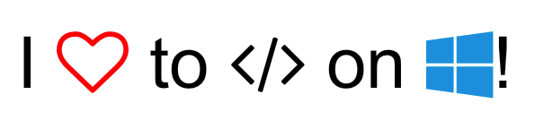

# SkiaSharp.Extended.Iconify

[](https://www.nuget.org/packages/SkiaSharp.Extended.Iconify)

A simple way to draw a string that contains icons inline with normal 
characters.

For example, if we wanted to draw this string using colored characters 
from FontAwesome (or some other icon font) mixed in with other characters:



To do this using factory SkiaSharp, there would be lots of work that 
needed doing. But, not anymore.

First, we can use nice templated strings:

```csharp
var text = "I {{fa-heart-o color=ff0000}} to {{fa-code}} on {{fa-windows color=1BA1E2}}!";
```

There are a few things that make this work:
 - The `{{...}}` double curly braces tell the engine that this is a 
   special character.
 - The first part of the block is CSS class name of the FontAwesome 
   icon. In the case of the red heart outline, this is the `fa-heart-o`.
 - The second part is optional, and can be specified to control the 
   color `color=ff0000`. In this case, we are specifying red using 
   the hex color code, `#FF0000`.

More optional flags may be added later, but right now there is just the
`color` flag. This flag can be any value that can be passed to the
`SKColor.Parse` method.

To draw this text, all we have to do is register the icon font in 
app startup, or whenever we need:

```csharp
SKTextRunLookup.Instance.AddFontAwesome();
```

Now, we can draw the string anywhere in the app:

```csharp
// create the paint that represents the default text
var paint = new SKPaint();

// draw the text, inserting all the FontAwesome characters
canvas.DrawIconifiedText(text, 10, 100, paint);
```


## Supported Icon Fonts

There are several icon fonts that are currently supported:

 - **FontAwesome** - http://fontawesome.io/
 - **IonIcons** - http://ionicons.com/
 - **Material Design Icons** (community) - https://materialdesignicons.com/
 - **Material Icons** (Google) - https://material.io/icons/
 - **Meteocons** - http://www.alessioatzeni.com/meteocons/
 - **Simple Line Icons** - http://simplelineicons.com/
 - **Typicons** - http://www.typicons.com/
 - **WeatherIcons** - http://weathericons.io/

These are just what we have now, but it is very simple to add some more.
All we need is the `.ttf` font file and some mapping from a name to the
unicode character.


## Advanced

If we want to control what fonts are available for a specific 
draw operation, we can create a lookup table:

```csharp
// create the lookup table
var lookup = new SKTextRunLookup();

// add FontAwesome
lookup.AddTypeface(new FontAwesomeLookupEntry());
```

Now that we have our table, we can draw the string:

```csharp
// create the paint that represents the default text
var paint = new SKPaint();

// draw the text, inserting all the FontAwesome characters
canvas.DrawIconifiedText(text, 10, 100, lookup, paint);
```

For more advanced text substitutions, there is a way to directly 
control the creation of these strings. Instead of just passing a 
string to `DrawIconifiedText`, we can "cache" or pre-calculate 
this string using `SKTextRun`:

```csharp
// create the text runs
IEnumerable<SKTextRun> runs = SKTextRun.Create(text, lookup);

// draw the text
canvas.DrawText(runs, 10, 100, paint);
```

Another way to work with this is to directly create the text runs:

```csharp
var runs = new [] {
    new SKTextRun("I "),
    new SKTextRun("\uf08a") {
        Color = SKColors.Red,
        Typeface = SKTypeface.FromFamilyName("FontAwesome"),
        TextSize = 50
    },
    new SKTextRun(" to "),
    // ...
};
```
