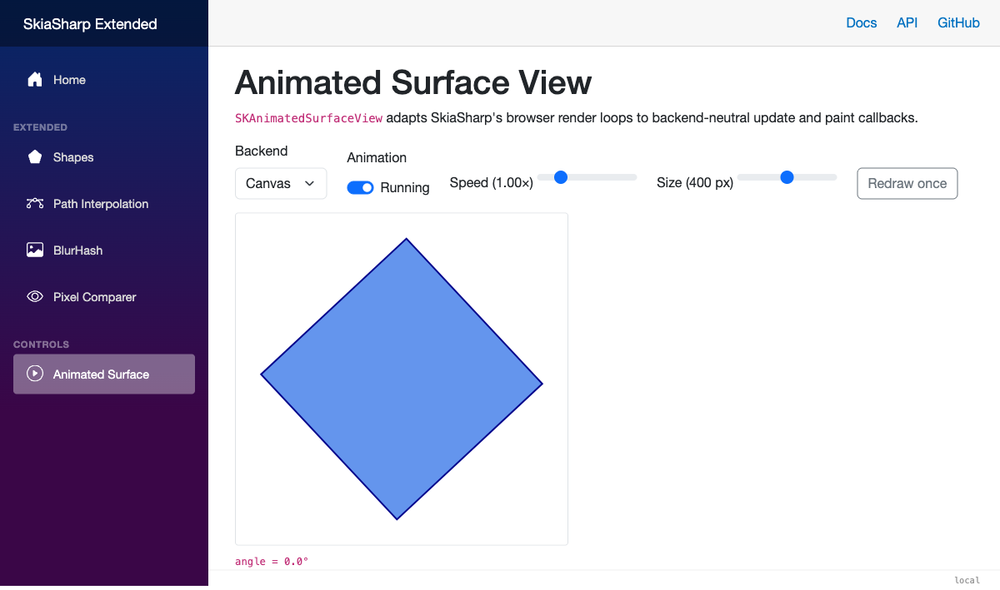
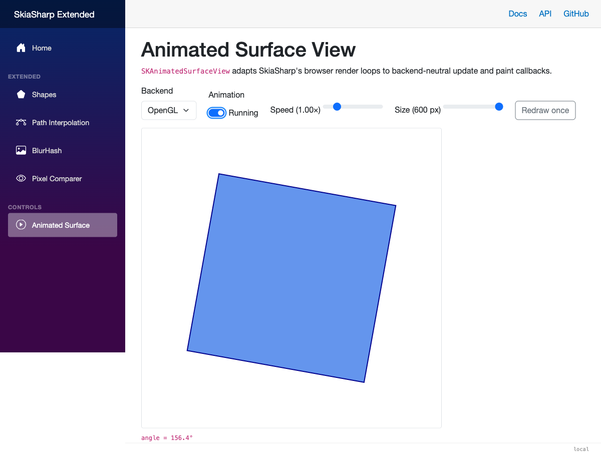

# Animated Surface View

[`SKAnimatedSurfaceView`](xref:SkiaSharp.Extended.UI.Blazor.Controls.SKAnimatedSurfaceView)
connects your update and drawing callbacks to the browser's animation-frame
loop. You can use it when a Blazor page needs a SkiaSharp scene that moves
smoothly without maintaining a separate timer.



## Quick start

Install the package:

```bash
dotnet add package SkiaSharp.Extended.UI.Blazor
```

Import the namespaces in `_Imports.razor`:

```razor
@using SkiaSharp
@using SkiaSharp.Extended.UI.Blazor.Controls
```

Then place the component on a page. `OnUpdate` runs immediately before
`OnPaintSurface` for every animated frame.

```razor
<SKAnimatedSurfaceView OnUpdate="Update"
                       OnPaintSurface="Paint"
                       style="width: 400px; height: 300px;" />

@code {
    private float angle;

    private void Update(TimeSpan delta)
    {
        angle = (angle + (float)(delta.TotalSeconds * 90)) % 360;
    }

    private void Paint(SKCanvas canvas, SKSize size)
    {
        canvas.Clear(SKColors.White);

        canvas.Translate(size.Width / 2, size.Height / 2);
        canvas.RotateDegrees(angle);

        using var paint = new SKPaint { Color = SKColors.CornflowerBlue, IsAntialias = true };
        canvas.DrawRect(-50, -50, 100, 100, paint);
    }
}
```

## Canvas and OpenGL

The component uses the Canvas backend by default. Set `Backend` to
`OpenGL` for GPU rendering; the component does not automatically switch
backends if OpenGL is unavailable.

```razor
<SKAnimatedSurfaceView Backend="SKAnimatedSurfaceViewBackend.OpenGL"
                       IgnorePixelScaling="true"
                       OnPaintSurface="Paint"
                       style="width: 400px; height: 300px;" />
```

`IgnorePixelScaling` is forwarded to the underlying SkiaSharp view. Additional
attributes such as `class`, `id`, and `style` are forwarded to its canvas.



## Pausing and on-demand redraws

Set `IsAnimationEnabled` to pause updates and browser-driven repainting. A
paused component can still draw a changed scene when you call `Invalidate()`.
The first update after creating, resuming, or switching backends receives a
zero delta so paused time is not added to the animation.

```razor
<button @onclick="ToggleAnimation">@(isPlaying ? "Pause" : "Play")</button>
<button @onclick="animatedSurface?.Invalidate()">Redraw once</button>

<SKAnimatedSurfaceView @ref="animatedSurface"
                       IsAnimationEnabled="isPlaying"
                       OnPaintSurface="Paint"
                       style="width: 400px; height: 300px;" />

@code {
    private SKAnimatedSurfaceView? animatedSurface;
    private bool isPlaying = true;

    private void ToggleAnimation() => isPlaying = !isPlaying;
}
```

## Learn more

- [SkiaSharp.Views.Blazor](https://learn.microsoft.com/dotnet/api/skiasharp.views.blazor)
- [API Reference](xref:SkiaSharp.Extended.UI.Blazor.Controls.SKAnimatedSurfaceView)
