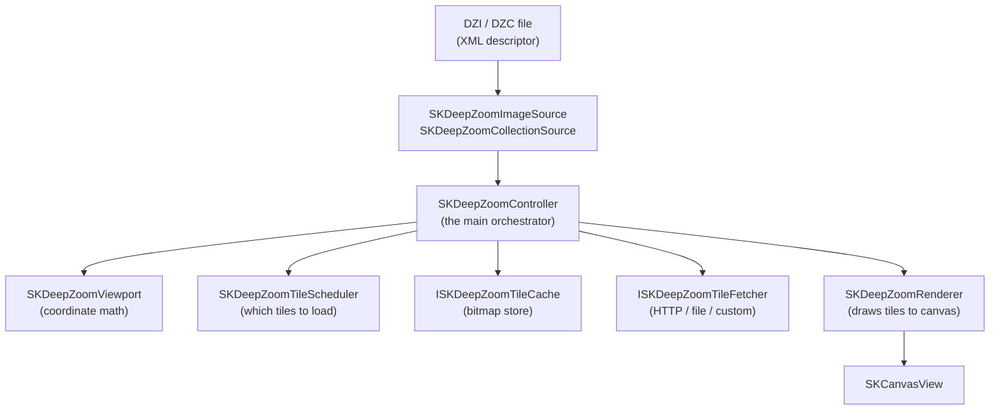

# Deep Zoom

Explore gigapixel images in your .NET MAUI and Blazor apps using the Deep Zoom Image (DZI) format. The deep zoom system downloads only the tiles visible at the current zoom level, so even multi-gigapixel images load instantly.

## What is Deep Zoom?

[Deep Zoom](https://docs.microsoft.com/en-us/previous-versions/windows/silverlight/dotnet-windows-silverlight/cc645050(v=vs.95)) is a tile-based image format developed by Microsoft. An image is pre-sliced into a pyramid of tiles at multiple resolutions. At any zoom level, only the small set of tiles visible in the viewport is loaded — making it practical to explore images with billions of pixels.

**When to use Deep Zoom:**
- 🗺️ High-resolution maps, satellite imagery, or floor plans
- 🎨 Gigapixel art, museum collection viewers
- 🔬 Medical imaging, microscopy slides
- 📸 Any image too large to load in full at once

## Architecture

The deep zoom system is intentionally minimal — there is **no custom control** and **no gesture system**. You wire the services directly to a plain `SKCanvasView`, giving you full control.

> **Library split:** The implementation is divided across two packages. `SkiaSharp.Extended.Abstractions` contains platform-agnostic types (controller, viewport, cache and fetcher interfaces). `SkiaSharp.Extended` contains the SkiaSharp-specific implementations (`SKDeepZoomRenderer`, `SKDeepZoomImageTile`, `SKDeepZoomImageTileDecoder`). In most cases you only need to reference `SkiaSharp.Extended`.



| Class | Responsibility |
| :---- | :------------- |
| `SKDeepZoomImageSource` | Parses a `.dzi` descriptor: image size, tile size, level count, tile URL construction. |
| `SKDeepZoomCollectionSource` | Parses a `.dzc` collection: a mosaic of many DZI sub-images. |
| `SKDeepZoomController` | The central orchestrator. Manages viewport, tile scheduling, caching, and rendering. |
| `SKDeepZoomViewport` | Coordinate math between screen pixels and logical (0–1) image space. |
| `SKDeepZoomTileScheduler` | Determines which tiles are visible and their fetch priority. |
| `ISKDeepZoomTileCache` | Pluggable tile cache interface (in-memory, browser storage, disk, tiered). |
| `SKDeepZoomMemoryTileCache` | Default thread-safe LRU in-memory cache for decoded images. |
| `ISKDeepZoomTileFetcher` | Pluggable fetcher interface (HTTP, file system, app package). |
| `SKDeepZoomHttpTileFetcher` | Built-in HTTP fetcher using `HttpClient`. |
| `SKDeepZoomFileTileFetcher` | Built-in file system fetcher for local/bundled tiles. |
| `ISKDeepZoomRenderer` | Pluggable renderer interface. |
| `SKDeepZoomRenderer` | Default renderer; LOD fallback blending, tile scheduling. |

## Quick Start

### 1. Create a controller

```csharp
using SkiaSharp.Extended;

// Default: in-memory LRU cache with 1024 tile capacity
var controller = new SKDeepZoomController();

// Or specify cache capacity
var controller = new SKDeepZoomController(defaultCacheCapacity: 512);
```

### 2. Load an image source

```csharp
// DZI (single image) — load XML and provide the tile base URL
var xml = await httpClient.GetStringAsync("https://example.com/image.dzi");
var tileSource = SKDeepZoomImageSource.Parse(xml, "https://example.com/image_files/");
controller.Load(tileSource, new SKDeepZoomHttpTileFetcher());

// DZC (collection of images)
var collXml = await httpClient.GetStringAsync("https://example.com/collection.dzc");
var collection = SKDeepZoomCollectionSource.Parse(collXml);
collection.TilesBaseUri = "https://example.com/";
controller.Load(collection, new SKDeepZoomHttpTileFetcher());
```

### 3. Wire the canvas

```csharp
void OnPaintSurface(SKPaintSurfaceEventArgs e)
{
    controller.SetControlSize(e.Info.Width, e.Info.Height);
    controller.Update();           // schedules tile loads for the current viewport
    controller.Render(e.Surface.Canvas);
}
```

### 4. Trigger repaints when tiles arrive

```csharp
controller.InvalidateRequired += (_, _) => myCanvasView.InvalidateSurface();
```

### 5. Dispose when done

```csharp
controller.Dispose();  // cancels in-flight requests and clears the cache
```

## Image Sources

### DZI — Single Images

A `.dzi` file describes a single image sliced into a tile pyramid:

```xml
<?xml version="1.0" encoding="utf-8"?>
<Image xmlns="http://schemas.microsoft.com/deepzoom/2008"
       Format="jpeg" Overlap="1" TileSize="256">
  <Size Width="32768" Height="32768"/>
</Image>
```

Parse it with a base URL pointing to the tile directory:

```csharp
var source = SKDeepZoomImageSource.Parse(xmlString, "https://example.com/image_files/");

// Key properties
int width     = source.ImageWidth;
int height    = source.ImageHeight;
int tileSize  = source.TileSize;
int overlap   = source.Overlap;
int maxLevel  = source.MaxLevel;
double aspect = source.AspectRatio;

// Tile URL construction
string url = source.GetFullTileUrl(level: 12, col: 3, row: 5);
```

The tile files are at `{baseUri}/{level}/{col}_{row}.{format}`.

### DZC — Collections

A `.dzc` file is a mosaic of many DZI images composited into a single tile pyramid:

```csharp
var collection = SKDeepZoomCollectionSource.Parse(xmlString);
collection.TilesBaseUri = "https://example.com/";
controller.Load(collection, fetcher);

// Sub-images are available after loading
foreach (var sub in controller.SubImages)
{
    Console.WriteLine($"#{sub.Id} — aspect {sub.AspectRatio:F2}");
}
```

## Viewport and Zoom

The viewport uses a **normalized coordinate system** where the full image width = 1.0:

```csharp
var vp = controller.Viewport;

// Zoom level: 1.0 = image fills the control width, >1.0 = zoomed in
double zoom = vp.Zoom;               // = 1.0 / ViewportWidth

// Native zoom: where 1 image pixel = 1 screen pixel
double native = controller.NativeZoom;

// Convert a screen tap to logical image coordinates
var (lx, ly) = vp.ElementToLogicalPoint(tapX, tapY);
```

## Programmatic Navigation

```csharp
// Pan by screen pixels
controller.Pan(deltaX, deltaY);

// Zoom about a screen point (e.g., mouse position)
controller.ZoomAboutScreenPoint(factor: 1.2, screenX, screenY);

// Zoom about a logical image point
controller.ZoomAboutLogicalPoint(factor: 1.5, logicalX: 0.5, logicalY: 0.5);

// Set explicit zoom level (1.0 = fit to width)
controller.SetZoom(zoom: 2.0);

// Reset to fit-to-view
controller.ResetView();
```

## Events

| Event | Description |
| :---- | :---------- |
| `ImageOpenSucceeded` | Image source loaded; controller is ready to render. |
| `ImageOpenFailed` | Image source failed to parse. |
| `InvalidateRequired` | A tile finished loading — trigger a canvas repaint. |
| `TileFailed` | A tile failed to download. |
| `ViewportChanged` | Viewport was moved or zoomed. |

## Platform Integration

- [Deep Zoom for Blazor](blazor.md) — Blazor WebAssembly integration guide
- [Deep Zoom for MAUI](maui.md) — .NET MAUI integration guide

## Deeper Dives

- [Controller & Viewport](controller.md) — Full controller API, viewport coordinate system, zoom semantics
- [Tile Fetching](fetching.md) — Built-in fetchers and how to implement custom fetchers
- [Caching](caching.md) — Cache interface, LRU memory cache, tiered caching, custom implementations

## Learn More

- [Deep Zoom specification](https://docs.microsoft.com/en-us/previous-versions/windows/silverlight/dotnet-windows-silverlight/cc645050(v=vs.95)) — Microsoft's original documentation
- [OpenSeadragon](https://openseadragon.github.io/) — Popular JavaScript Deep Zoom viewer
- [API Reference — SKDeepZoomController](xref:SkiaSharp.Extended.SKDeepZoomController)


