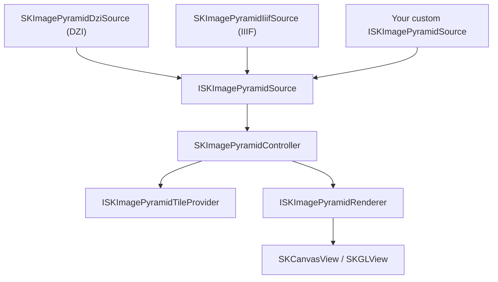

# Image Pyramid

Explore gigapixel images in your .NET MAUI and Blazor apps. The Image Pyramid system downloads only the tiles visible at the current zoom level, so even multi-gigapixel images load instantly — regardless of whether they come from Deep Zoom (DZI), IIIF, or any custom tile source.

## What is an Image Pyramid?

A **tiled image pyramid** pre-slices a large image into tiles at multiple resolutions. At any zoom level, only the small set of tiles visible in the viewport is loaded — making it practical to explore images with billions of pixels.

**When to use Image Pyramid:**
- 🗺️ High-resolution maps, satellite imagery, or floor plans
- 🎨 Gigapixel art, museum collection viewers
- 🔬 Medical imaging, microscopy slides
- 📸 Any image too large to load in full at once

## Architecture

The system is intentionally minimal — there is **no custom control** and **no gesture system**. You wire the services directly to a plain `SKCanvasView`, giving you full control.

> All types — controller, viewport, interfaces and SkiaSharp implementations — live in a single `SkiaSharp.Extended` library. There is no separate Abstractions package.



| Type | Responsibility |
| :---- | :------------- |
| `ISKImagePyramidSource` | Describes a tile pyramid: dimensions, level count, tile URL generation. |
| `SKImagePyramidDziSource` | Parses Microsoft Deep Zoom Image (`.dzi`) files. |
| `SKImagePyramidDziCollectionSource` | Parses Deep Zoom Collection (`.dzc`) files. |
| `SKImagePyramidIiifSource` | Parses IIIF Image API v2/v3 `info.json`. |
| `SKImagePyramidController` | The central orchestrator: viewport, scheduling, render buffer, rendering. |
| `SKImagePyramidViewport` | Coordinate math between screen pixels and logical (0–1) image space. |
| `ISKImagePyramidTileProvider` | Owns the full fetch+cache pipeline for a tile URL. |
| `SKImagePyramidHttpTileProvider` | Built-in HTTP provider with optional disk cache; decodes with `SKImage.FromEncodedData`. |
| `SKImagePyramidFileTileProvider` | Built-in local file provider (no disk cache — the file IS the source). |
| `ISKImagePyramidRenderer` | Pluggable renderer interface. |
| `SKImagePyramidRenderer` | Default SkiaSharp renderer; LOD blending, tile compositing. |

## Quick Start

### 1. Create a controller

```csharp
using SkiaSharp.Extended;

var controller = new SKImagePyramidController();
```

### 2. Load an image source

```csharp
// Deep Zoom Image (DZI)
var xml = await httpClient.GetStringAsync("https://example.com/image.dzi");
var source = SKImagePyramidDziSource.Parse(xml, "https://example.com/image_files/");
controller.Load(source, new SKImagePyramidHttpTileProvider());

// IIIF Image API
var json = await httpClient.GetStringAsync("https://example.com/image/info.json");
var iiifSource = SKImagePyramidIiifSource.Parse(json);
controller.Load(iiifSource, new SKImagePyramidHttpTileProvider());
```

### 3. Wire the canvas

```csharp
private readonly SKImagePyramidRenderer _renderer = new();

void OnPaintSurface(SKPaintSurfaceEventArgs e)
{
    controller.SetControlSize(e.Info.Width, e.Info.Height);
    controller.Update();
    _renderer.Canvas = e.Surface.Canvas;
    controller.Render(_renderer);
}
```

### 4. Trigger repaints when tiles arrive

```csharp
controller.InvalidateRequired += (_, _) => myCanvasView.InvalidateSurface();
```

### 5. Dispose when done

```csharp
controller.Dispose();
```

## Image Sources

The `ISKImagePyramidSource` interface is the key abstraction. Swap sources to use different tile formats without changing any other code:

| Source | Format | Notes |
| :----- | :----- | :---- |
| `SKImagePyramidDziSource` | Deep Zoom Image (`.dzi`) | Microsoft DZI format |
| `SKImagePyramidDziCollectionSource` | Deep Zoom Collection (`.dzc`) | Multi-image mosaics |
| `SKImagePyramidIiifSource` | IIIF Image API v2/v3 | Museum/archive images |
| Custom `ISKImagePyramidSource` | Any | Zoomify, custom tile servers, etc. |

See the [Image Sources](deepzoom.md) section for details on each format.

## Platform Integration

- [Image Pyramid for Blazor](blazor.md)
- [Image Pyramid for .NET MAUI](maui.md)

## Deeper Dives

- [Controller & Viewport](controller.md)
- [Tile Fetching](fetching.md)
- [Caching](caching.md)

## Learn More

- [API Reference — SKImagePyramidController](xref:SkiaSharp.Extended.SKImagePyramidController)
- [OpenSeadragon](https://openseadragon.github.io/) — Popular JS viewer (DZI/IIIF compatible)
- [IIIF Image API 3.0 Spec](https://iiif.io/api/image/3.0/)

