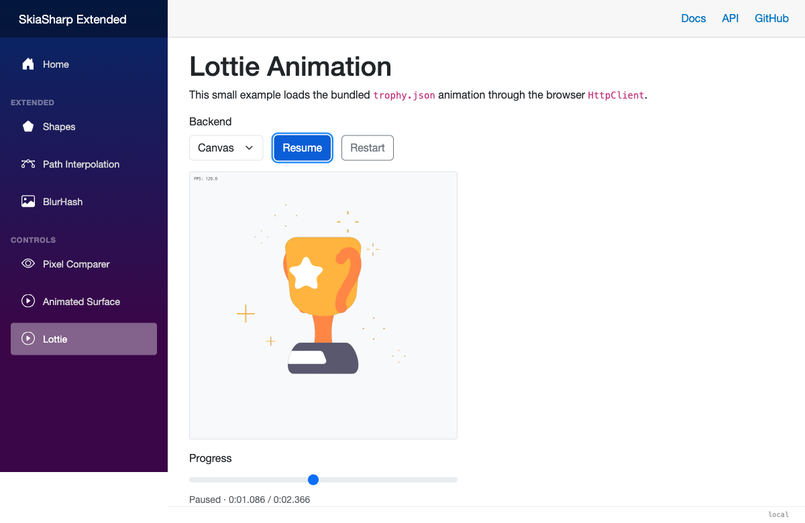
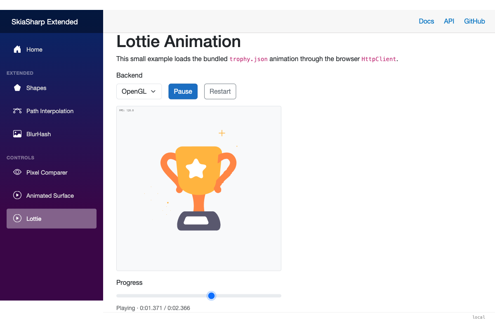

# Blazor Lottie Animations

[`SKLottieView`](xref:SkiaSharp.Extended.UI.Blazor.Components.SKLottieView) plays Lottie JSON in Blazor WebAssembly and Interactive
WebAssembly with SkiaSharp. It does not support Interactive Server or unrestricted Interactive Auto because SkiaSharp's browser rendering
host must be interactive in the browser. It uses the shared [`SKLottiePlayer`](lottie-player.md) engine with
[`SKAnimatedSurfaceView`](animated-surface-blazor.md). The surface owns the browser render loop and timing, so frames are updated and
painted together without a component render per frame. Its monotonic timing and rolling frame-rate calculation are shared with the .NET
MAUI animated surface.



URI, JSON, and stream sources use one internal shared loader with cached Data URI resources and the default SkiaSharp font manager. Each
load creates a private native animation for that view; `SKLottiePlayer` manages playback state, seeking, repeat behavior, and rendering.

In DEBUG builds, the underlying animated surface draws an FPS label after each Lottie frame. The diagnostic is not included in release
builds.

## Quick Start

Install the package and add its namespaces to `_Imports.razor`:

```bash
dotnet add package SkiaSharp.Extended.UI.Blazor
```

```razor
@using SkiaSharp.Extended
@using SkiaSharp.Extended.UI.Blazor.Components
```

Render a Lottie file:

```razor
<SKLottieView Source="animations/trophy.json"
              Repeat="SKLottieRepeat.Restart()"
              style="width: 300px; height: 300px;" />
```

The default `Repeat` is `SKLottieRepeat.Never`, so an animation plays once.
The render loop runs only while the view is enabled, an animation is loaded,
and playback has not completed.

## Rendering Surface

`SKLottieView` composes and forwards the generic surface's rendering options. Canvas is the
default; select OpenGL when your app benefits from SkiaSharp's GPU-backed
Blazor view. Set `IgnorePixelScaling` when the canvas should use CSS pixels
rather than physical pixels:

```razor
<SKLottieView Source="animations/trophy.json"
              SurfaceType="@typeof(SKGLView)"
              IgnorePixelScaling="true"
              style="width: 300px; height: 300px;" />
```

`SurfaceType` can also be a custom component derived from `SKCanvasView` or
`SKGLView`.



## Playback Controls

Use `SKLottieRepeat` directly to select the repeat behavior:

```razor
@* Play once *@
<SKLottieView Source="animation.json"
              Repeat="SKLottieRepeat.Never" />

@* Restart forever *@
<SKLottieView Source="animation.json"
              Repeat="SKLottieRepeat.Restart()" />

@* Three additional restart plays *@
<SKLottieView Source="animation.json"
              Repeat="SKLottieRepeat.Restart(3)" />

@* Ping-pong once, forward then back *@
<SKLottieView Source="animation.json"
              Repeat="SKLottieRepeat.Reverse(0)" />
```

`Restart(count)` counts additional full plays. `Reverse(count)` counts
additional forward/back cycles; `Reverse(0)` therefore performs one complete
forward/back cycle. Use a negative `AnimationSpeed` to begin at the end and
play in reverse.

Pause or resume by binding `IsAnimationEnabled`. Use `Seek` from a slider,
button, or other event handler. Bind `ProgressChanged` only when the page needs
periodic progress reporting; the callback is throttled to about 10 updates per
second rather than running for every animation frame:

```razor
<SKLottieView @ref="lottieView"
              Source="animation.json"
              IsAnimationEnabled="@isPlaying"
              ProgressChanged="OnProgressChanged" />

<button @onclick="() => isPlaying = !isPlaying">Pause or resume</button>
<button @onclick="RestartAnimation">Restart</button>

<input type="range"
       min="0"
       max="@Math.Max(1, duration.TotalMilliseconds)"
       value="@progress.TotalMilliseconds"
       @oninput="Seek" />

@code {
    private SKLottieView? lottieView;
    private bool isPlaying = true;
    private TimeSpan progress;
    private TimeSpan duration;

    private void RestartAnimation()
    {
        if (lottieView is not null)
            lottieView.Seek(TimeSpan.Zero);
    }

    private void OnProgressChanged(TimeSpan value)
    {
        progress = value;
        duration = lottieView?.Duration ?? TimeSpan.Zero;
    }

    private void Seek(ChangeEventArgs e)
    {
        if (lottieView is not null &&
            double.TryParse(
                e.Value?.ToString(),
                System.Globalization.NumberStyles.Float,
                System.Globalization.CultureInfo.InvariantCulture,
                out var milliseconds))
        {
            progress = TimeSpan.FromMilliseconds(milliseconds);
            lottieView.Seek(progress);
        }
    }
}
```

## Events and State

`AnimationLoaded`, `AnimationFailed`, and `AnimationCompleted` report load and playback transitions. Completion is dispatched after the
frame update has been rendered. `ProgressChanged` is opt-in and throttled, so it does not create an async callback for every rendered frame.

Read `HasAnimation`, `Duration`, `Progress`, and `IsComplete` through an `@ref`.
Additional attributes such as `style` and `class` are passed
to the underlying canvas.

## Loading Sources

Strings, including the quick-start example, are URLs relative to `wwwroot` or absolute URLs. URI loading uses the app's registered default
`HttpClient`. Use a custom `SKLottieImageSource` when an endpoint needs specialized authentication or request handling.

For data that is already in your app, use raw JSON or a stream factory. The factory must return a fresh readable stream every time; the
component disposes each stream after reading it. This keeps database, blob, and application-service integrations in your app layer rather
than in the control API:

```csharp
var source = SKLottieImageSource.FromStream(
    cancellationToken => new ValueTask<Stream>(
        blobStore.OpenAnimationAsync(cancellationToken)));
```

Use `SKLottieImageSource.FromJson(json)` when your app already has the payload. Browser storage and `InputFile` are also app-layer concerns.
The sample page uses an `InputFile` picker with a 5 MiB limit and reads the selected JSON into `FromJson`; picker types are not part of the
library API.

For a fully custom loader, derive from `SKLottieImageSource` and override `LoadAnimationAsync`. The view supplies a cancellation token;
custom loaders own any specialized authentication or client configuration. Return a new `SKLottieAnimation` result for each successful
load; native Skottie animations contain mutable playback state and must not be shared between views. Assign a new custom source instance
when its underlying data should be reloaded.

## Learn More

- [Lottie Player](lottie-player.md) — shared playback semantics
- [MAUI Lottie Animations](lottie-maui.md) — use Lottie in .NET MAUI
- [Lottie](https://airbnb.design/lottie/) — animation format overview
- [API Reference](xref:SkiaSharp.Extended.UI.Blazor.Components.SKLottieView)
