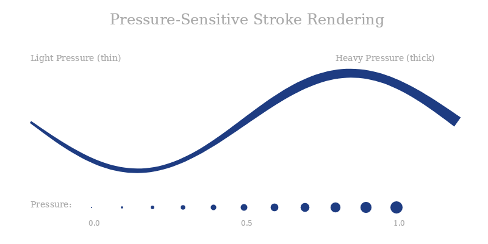

# SkiaSharp.Extended.Inking

A platform-independent digital inking engine for SkiaSharp that provides smooth, pressure-sensitive, velocity-aware stroke rendering.


## Overview

The inking engine provides pressure-sensitive, velocity-aware digital ink rendering with these components:

| Component | Description |
|:----------|:------------|
| **SKInkPoint** | A point with pressure, tilt, velocity, and timestamp |
| **SKInkStrokeBrush** | Appearance settings: color, size range, cap style, smoothing, velocity mode |
| **SKInkStroke** | A single stroke with variable-width rendering |
| **SKInkCanvas** | An engine for managing strokes, selection, and export |
| **SKInkRecording** | Record and playback ink strokes |

## Installation

The inking engine is part of the main SkiaSharp.Extended package:

```
dotnet add package SkiaSharp.Extended
```

## Basic Usage

### Creating an Ink Canvas

```csharp
using SkiaSharp.Extended.Inking;

// Create an ink canvas with default settings
var inkCanvas = new SKInkCanvas();

// Configure the default brush
inkCanvas.Brush = new SKInkStrokeBrush
{
    Color = SKColors.DarkBlue,
    MinSize = new SKSize(2, 2),    // Width at 0 pressure
    MaxSize = new SKSize(10, 10),  // Width at 1 pressure
    CapStyle = SKStrokeCapStyle.Round,
    SmoothingAlgorithm = SKSmoothingAlgorithm.CatmullRom,
    SmoothingFactor = 4
};

// Subscribe to events
inkCanvas.Invalidated += (s, e) => Redraw();
inkCanvas.StrokeCompleted += (s, e) => Console.WriteLine($"Stroke {e.StrokeCount} completed");
```

### Drawing Strokes

```csharp
// Start a new stroke with a point
var point = new SKInkPoint(100f, 100f, pressure: 0.5f);
inkCanvas.StartStroke(point);

// Continue the stroke as the user moves
inkCanvas.ContinueStroke(new SKInkPoint(150f, 120f, pressure: 0.7f));
inkCanvas.ContinueStroke(new SKInkPoint(200f, 110f, pressure: 0.4f));

// End the stroke
inkCanvas.EndStroke(new SKInkPoint(250f, 130f, pressure: 0.3f));
```

### Rendering

```csharp
// In your SkiaSharp paint handler
void OnPaintSurface(SKCanvas canvas)
{
    canvas.Clear(SKColors.White);
    
    using var paint = new SKPaint
    {
        Style = SKPaintStyle.Fill,
        IsAntialias = true
    };
    
    inkCanvas.Draw(canvas, paint);
}
```

## SKInkPoint

Represents a single point in a stroke with full sensor data.

```csharp
// Simple point with pressure
var point = new SKInkPoint(100f, 200f, pressure: 0.6f);

// Full point with tilt and timestamp (microseconds)
var fullPoint = new SKInkPoint(
    x: 100f, 
    y: 200f, 
    pressure: 0.6f,
    tiltX: 15f,      // -90 to +90 degrees
    tiltY: -5f,      // -90 to +90 degrees
    timestampMicroseconds: 1234567890
);

// Access properties
float x = point.X;
float y = point.Y;
SKPoint location = point.Location;
float pressure = point.Pressure;  // 0.0 to 1.0 (clamped)
float tiltX = point.TiltX;        // Pen angle
float tiltY = point.TiltY;        // Pen angle
float velocity = point.Velocity;  // Calculated px/ms
long timestamp = point.TimestampMicroseconds;

// Calculate velocity between points
float v = SKInkPoint.CalculateVelocity(previousPoint, currentPoint);

// Create a point with specific velocity
var pointWithVelocity = point.WithVelocity(2.5f);
```

## SKInkStrokeBrush

Controls the appearance of strokes. The canvas has a default brush that is cloned when a stroke starts.

```csharp
var brush = new SKInkStrokeBrush
{
    // Appearance
    Color = SKColors.DarkBlue,
    MinSize = new SKSize(2, 2),    // Width at pressure 0
    MaxSize = new SKSize(10, 10),  // Width at pressure 1
    CapStyle = SKStrokeCapStyle.Tapered,  // Round, Flat, or Tapered
    
    // Smoothing
    SmoothingAlgorithm = SKSmoothingAlgorithm.CatmullRom,  // or QuadraticBezier
    SmoothingFactor = 4,  // 1-10 (higher = smoother)
    
    // Velocity effects (like Windows Ink ballpoint pen/pencil)
    VelocityMode = SKVelocityMode.BallpointPen,  // None, BallpointPen, Pencil
    VelocityScale = 0.5f  // 0.0-1.0 effect strength
};

// Clone for isolated modification
var clonedBrush = brush.Clone();

// Calculate width from pressure
float width = brush.GetWidthForPressure(pressure: 0.7f);

// Calculate width from pressure AND velocity
float widthWithVelocity = brush.GetWidthForPressureAndVelocity(
    pressure: 0.7f, 
    velocity: 2.0f  // px/ms
);

// Get alpha-adjusted color for Pencil mode (faster = lighter)
SKColor color = brush.GetColorForVelocity(velocity: 2.0f);
```

### Cap Styles

| Style | Description |
|:------|:------------|
| **Round** | Semicircular caps at ends (default) |
| **Flat** | Square/butt caps |
| **Tapered** | Narrows to a point (natural pen lift effect) |

### Velocity Modes

| Mode | Effect |
|:-----|:-------|
| **None** | Velocity has no effect (pressure-only) |
| **BallpointPen** | Faster = thinner stroke (simulates ink flow) |
| **Pencil** | Faster = thinner AND lighter (simulates graphite) |

### Smoothing Algorithms

| Algorithm | Description |
|:----------|:------------|
| **CatmullRom** | Interpolates through all control points (best for handwriting) |
| **QuadraticBezier** | Approximates through midpoints (smoother curves) |

## SKInkStroke

A single stroke with pressure-sensitive variable-width rendering.

### Properties

| Property | Type | Description |
|:---------|:-----|:------------|
| **Brush** | `SKInkStrokeBrush` | Appearance settings |
| **Points** | `IReadOnlyList<SKInkPoint>` | The points in the stroke |
| **PointCount** | `int` | Number of points |
| **IsEmpty** | `bool` | Whether the stroke has no points |
| **Path** | `SKPath?` | The rendered path (cached) |
| **Bounds** | `SKRect` | Bounding rectangle |
| **IsSelected** | `bool` | Selection state |

### Rendering Algorithm

1. **Point Collection**: Touch points with pressure, tilt, velocity
2. **Distance Filtering**: Points too close are filtered to reduce noise
3. **Curve Smoothing**: Catmull-Rom or Quadratic Bézier interpolation
4. **Variable Width**: Width from pressure and velocity
5. **Polygon Rendering**: Filled polygon with offset curves
6. **Cap Rendering**: Round, flat, or tapered caps



## SKInkCanvas

Manages multiple strokes with selection, undo, and export.

### Properties

| Property | Type | Description |
|:---------|:-----|:------------|
| **Brush** | `SKInkStrokeBrush` | Default brush for new strokes |
| **Strokes** | `IReadOnlyList<SKInkStroke>` | Completed strokes |
| **CurrentStroke** | `SKInkStroke?` | Stroke being drawn |
| **SelectedStrokes** | `IReadOnlyList<SKInkStroke>` | Selected strokes |
| **StrokeCount** | `int` | Number of completed strokes |
| **IsBlank** | `bool` | Whether canvas has no strokes |
| **IsDrawing** | `bool` | Whether a stroke is in progress |

### Methods

| Method | Description |
|:-------|:------------|
| **StartStroke(point)** | Begins a new stroke with default brush |
| **StartStroke(point, brush)** | Begins with custom brush |
| **ContinueStroke(point)** | Adds a point to current stroke |
| **EndStroke(point)** | Completes the current stroke |
| **CancelStroke()** | Cancels without saving |
| **Undo()** | Removes the last stroke |
| **Clear()** | Removes all strokes |
| **SelectStroke(stroke)** | Selects a stroke |
| **DeselectStroke(stroke)** | Deselects a stroke |
| **SelectStrokesInRect(rect)** | Selects strokes in rectangle |
| **DeselectAll()** | Deselects all strokes |
| **DeleteSelected()** | Deletes selected strokes |
| **ToPath()** | Gets combined path |
| **ToImage(w, h, bg)** | Renders to image |
| **GetBounds()** | Gets bounding rectangle |
| **Draw(canvas, paint)** | Draws all strokes |

### Events

| Event | Description |
|:------|:------------|
| **StrokeStarted** | Raised when a stroke begins |
| **StrokeCompleted** | Raised when a stroke is finished |
| **Cleared** | Raised when canvas is cleared |
| **Invalidated** | Raised when redraw is needed |
| **SelectionChanged** | Raised when selection changes |

## Selection

The canvas supports stroke selection for editing workflows:

```csharp
// Select strokes in a rectangle
inkCanvas.SelectStrokesInRect(new SKRect(50, 50, 200, 200));

// Check selected strokes
foreach (var stroke in inkCanvas.SelectedStrokes)
{
    Console.WriteLine($"Selected stroke with {stroke.PointCount} points");
}

// Delete selected strokes
inkCanvas.DeleteSelected();

// Deselect all
inkCanvas.DeselectAll();

// Selection changed event
inkCanvas.SelectionChanged += (s, e) =>
{
    Console.WriteLine($"Selection changed: {inkCanvas.SelectedStrokes.Count} selected");
};
```

## Recording and Playback

Record strokes and play them back for demonstrations or tutorials.

### Recording

```csharp
// Record from an existing canvas
var recording = SKInkRecording.FromCanvas(inkCanvas);

// Or create a sample signature
var sampleSignature = SKInkRecording.CreateSampleSignature(width: 400, height: 200);
```

### Playback

```csharp
// Create a player
var player = new SKInkPlayer();
player.PlaybackSpeed = 1.5f;  // 1.5x speed
player.Load(recording, targetCanvas);

// Start playback
player.Play();

// In your animation loop
while (player.IsPlaying)
{
    player.Update();
    Invalidate();
    await Task.Delay(16);  // ~60 FPS
}

// Or play instantly
player.PlayInstant();
```

## Integration with MAUI

For .NET MAUI applications, use the `SKSignaturePadView` control:

```xaml
<skia:SKSignaturePadView
    x:Name="signaturePad"
    StrokeColor="DarkBlue"
    MinStrokeWidth="2"
    MaxStrokeWidth="10"
    PadBackgroundColor="Ivory" />
```

Access the underlying ink canvas:

```csharp
SKInkCanvas inkCanvas = signaturePad.InkCanvas;
```

See [SKSignaturePadView documentation](sksignaturepadview.md) for more details.

## Example: Custom Ink View

Creating a custom ink view in SkiaSharp:

```csharp
public class CustomInkView : SKCanvasView
{
    private readonly SKInkCanvas inkCanvas = new SKInkCanvas();
    private readonly SKPaint inkPaint = new SKPaint
    {
        Style = SKPaintStyle.Fill,
        IsAntialias = true
    };

    public CustomInkView()
    {
        // Configure brush
        inkCanvas.Brush = new SKInkStrokeBrush
        {
            Color = SKColors.Black,
            MinSize = new SKSize(2, 2),
            MaxSize = new SKSize(10, 10),
            CapStyle = SKStrokeCapStyle.Tapered,
            VelocityMode = SKVelocityMode.BallpointPen,
            VelocityScale = 0.3f
        };

        inkCanvas.Invalidated += (s, e) => InvalidateSurface();
        EnableTouchEvents = true;
    }

    protected override void OnPaintSurface(SKPaintSurfaceEventArgs e)
    {
        var canvas = e.Surface.Canvas;
        canvas.Clear(SKColors.White);
        inkCanvas.Draw(canvas, inkPaint);
    }

    protected override void OnTouch(SKTouchEventArgs e)
    {
        var point = new SKInkPoint(
            e.Location.X, 
            e.Location.Y,
            e.Pressure > 0 ? e.Pressure : 0.5f,
            tiltX: 0,
            tiltY: 0,
            timestampMicroseconds: DateTimeOffset.UtcNow.ToUnixTimeMilliseconds() * 1000
        );

        switch (e.ActionType)
        {
            case SKTouchAction.Pressed:
                inkCanvas.StartStroke(point);
                break;
            case SKTouchAction.Moved:
                inkCanvas.ContinueStroke(point);
                break;
            case SKTouchAction.Released:
                inkCanvas.EndStroke(point);
                break;
        }

        e.Handled = true;
    }
}
```

## Performance Considerations

- **Path Caching**: Stroke paths are cached and only regenerated when points change
- **Point Filtering**: Points too close together are filtered to reduce rendering load  
- **Velocity Calculation**: Velocity is calculated automatically from timestamps
- **Dispose**: Always dispose strokes and canvases when done to free SKPath resources

```csharp
// Proper disposal
using (var inkCanvas = new SKInkCanvas())
{
    // Use the canvas
} // Automatically disposed
```

## API Comparison

See [Inking API Comparison](inking-api-comparison.md) for a detailed comparison with Windows.UI.Input.Inking.
