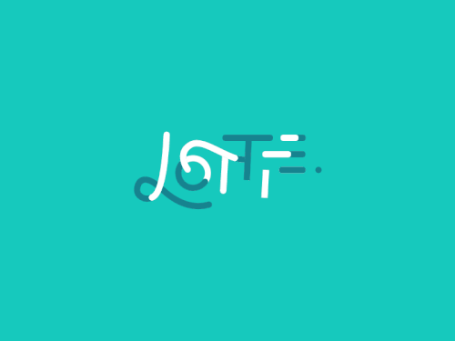

# SKLottieView

The Lottie view is a animated view that can playback Lottie files.

| Preview |
| :-----: |
|  |

## Properties

There are several properties that can be used to control th animation playback:

| Property               | Type                   | Description |
| :--------------------- | :--------------------- | :---------- |
| **Source**             | `SKLottieImageSource`  | The Lottie image source to playback in the view. |
| **Duration**           | `TimeSpan`             | A value indicating the total duration of the animation. |
| **Progress**           | `TimeSpan`             | The current playback progress of the animation. |
| **RepeatCount**        | `int`                  | The number of times to repeat the animation. Default is 0 (no repeat). A negative (-1) value will repeat forever. |
| **RepeatMode**         | `SKLottieRepeatMode`   | The way in which to repeat the animation. Default is `Restart`. |
| **IsAnimationEnabled** | `bool`                 | Determines whether the control will play the animation provided. |
| **IsComplete**         | `bool`                 | A value that indicates whether all systems are complete. |
| **FrameCount**         | `int`                  | The total number of frames in the animation. Returns 0 if no animation is loaded. |
| **CurrentFrame**       | `int`                  | The current frame of the animation based on the current progress. Returns 0 if no animation is loaded. |

## Methods

There are several methods for frame-based playback control:

| Method                           | Description |
| :------------------------------- | :---------- |
| **SeekToFrame(int frameNumber)** | Seeks the animation to a specific frame (0-based). The animation will continue playing from this frame if `IsAnimationEnabled` is true. |
| **SeekToFrameAndStop(int frameNumber)** | Seeks the animation to a specific frame and stops playback. This is equivalent to Lottie's `goToAndStop` method. |
| **SeekToFrameAndPlay(int frameNumber)** | Seeks the animation to a specific frame and starts playback. This is equivalent to Lottie's `goToAndPlay` method. |

## Events

There are a few events that can be used to be notified of animation loading events:

| Event                   | Type            | Description |
| :---------------------- | :-------------- | :---------- |
| **AnimationLoaded**     | `EventHandler`  | Invoked when the animation has loaded successfully. |
| **AnimationFailed**     | `EventHandler`  | Invoked when there was an error loading the animation. |
| **AnimationCompleted**  | `EventHandler`  | Invoked when the animation is finished playing (after all the repeats). Infinite animations never complete so will not trigger the event. |

## Usage Examples

### Frame-Based Playback

You can use frame-based methods to create interactive animations, such as switches, toggles, or scrubbers:

```csharp
// Seek to a specific frame (e.g., for a switch animation)
lottieView.SeekToFrameAndStop(30);

// Jump to frame and continue playing
lottieView.SeekToFrameAndPlay(0);

// Check current frame and total frames
int current = lottieView.CurrentFrame;
int total = lottieView.FrameCount;
```

### Time-Based Playback

You can also use time-based properties for smooth playback control:

```csharp
// Set progress to middle of animation
lottieView.Progress = TimeSpan.FromSeconds(lottieView.Duration.TotalSeconds / 2);

// Stop animation
lottieView.IsAnimationEnabled = false;

// Resume animation
lottieView.IsAnimationEnabled = true;
```

### Creating a Switch Animation

For creating a switch using a Lottie animation (as mentioned in the feature request):

```csharp
private bool isOn = false;

private void OnSwitchToggled(object sender, EventArgs e)
{
    if (isOn)
    {
        // Go to "off" state (e.g., first frame)
        lottieView.SeekToFrameAndStop(0);
    }
    else
    {
        // Go to "on" state (e.g., last frame)
        lottieView.SeekToFrameAndStop(lottieView.FrameCount - 1);
    }
    
    isOn = !isOn;
}
```

For animated transitions between states:

```csharp
private bool isOn = false;

private async void OnSwitchToggled(object sender, EventArgs e)
{
    if (isOn)
    {
        // Animate from current position to "off" state
        lottieView.RepeatCount = 0;  // Play once
        lottieView.SeekToFrameAndPlay(lottieView.FrameCount / 2);
        
        // Wait for animation to complete
        await Task.Delay(lottieView.Duration / 2);
        lottieView.IsAnimationEnabled = false;
    }
    else
    {
        // Animate from current position to "on" state  
        lottieView.RepeatCount = 0;  // Play once
        lottieView.SeekToFrameAndPlay(0);
        
        // Wait for animation to complete
        await Task.Delay(lottieView.Duration / 2);
        lottieView.IsAnimationEnabled = false;
    }
    
    isOn = !isOn;
}
```

**Note**: The animation should be designed with the switch states at specific frames (e.g., frame 0 for "off", last frame for "on").

## Parts

In addition to the properties on the view, there is the overall control template that can directly influence the visual appearance of the view. The default template is defined as:

```xaml
<ControlTemplate x:Key="SKLottieViewControlTemplate">
    <skia:SKCanvasView x:Name="PART_DrawingSurface" />
</ControlTemplate>
```

| Part                     | Description |
| :----------------------- | :---------- |
| **PART_DrawingSurface**  | This part can either be a `SKCanvasView` or a `SKGLView` and describes the actual rendering surface for the animation. |
