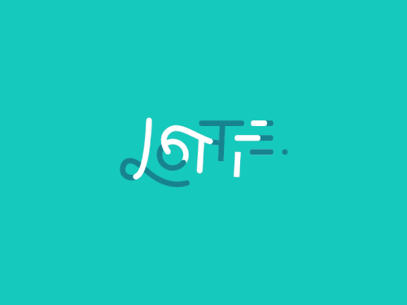

# SKLottieView

The Lottie view is a animated view that can playback Lottie files.

| Preview |
| :-----: |
|  |

## Properties

There are several properties that can be used to control th animation playback:

| Property               | Type                   | Description |
| :--------------------- | :--------------------- | :---------- |
| **Source**             | `SKLottieImageSource`  | The Lottie image source to playback in the view. |
| **Duration**           | `TimeSpan`             | A value indicating the total duration of the animation. |
| **Progress**           | `TimeSpan`             | The current playback progress of the animation. |
| **RepeatCount**        | `int`                  | The number of times to repeat the animation. Default is 0 (no repeat). A negative (-1) value will repeat forever. |
| **RepeatMode**         | `SKLottieRepeatMode`   | The way in which to repeat the animation. Default is `Restart`. |
| **IsAnimationEnabled** | `bool`                 | Determines whether the control will play the animation provided. |
| **IsComplete**         | `bool`                 | A value that indicates whether all systems are complete. |

### Image Source Properties

The `SKLottieImageSource` and its derived classes support the following property for loading external image assets:

| Property               | Type                   | Description |
| :--------------------- | :--------------------- | :---------- |
| **ImageAssetsFolder**  | `string`               | The folder path where external image assets referenced in the Lottie JSON file are located. This is required when your animation references external image files (e.g., `"p": "img_0.png"`) instead of embedding them as base64 data URIs. |

### Available Image Source Types

| Type                        | Purpose | Example |
| :-------------------------- | :------ | :------ |
| **SKFileLottieImageSource** | Load animation from a JSON file | `Source = new SKFileLottieImageSource { File = "animation.json" }` |
| **SKUriLottieImageSource**  | Load animation from a URL | `Source = new SKUriLottieImageSource { Uri = new Uri("https://example.com/animation.json") }` |
| **SKStreamLottieImageSource** | Load animation from a stream | `Source = new SKStreamLottieImageSource { Stream = myStreamGetter }` |
| **SKDotLottieImageSource**  | Load animation from a .lottie file | `Source = new SKDotLottieImageSource { File = "animation.lottie" }` |

## Loading External Image Assets

Lottie animations can reference external image files that are stored separately from the animation JSON. To use external images:

1. Place your image files in a folder accessible via the file system
2. Set the `ImageAssetsFolder` property on the `Source` to the folder path where the images are located

> [!IMPORTANT]
> **Current Limitation**: The `ImageAssetsFolder` property currently only works with file system paths and cannot access MAUI app package resources (files in `Resources/Raw`). This is because the underlying `FileResourceProvider` from SkiaSharp.Resources uses standard file I/O and does not support `FileSystem.OpenAppPackageFileAsync()`.
>
> **Workaround Options**:
> - Use absolute file system paths where images are extracted/copied at runtime
> - Embed images as base64 data URIs directly in the Lottie JSON file
> - Wait for a future update when custom ResourceProvider inheritance is supported
>
> This limitation is being tracked and will be addressed in a future update when SkiaSharp.Resources allows custom ResourceProvider implementations.

### Example in XAML

```xaml
<controls:SKLottieView>
    <controls:SKLottieView.Source>
        <controls:SKFileLottieImageSource 
            File="animations/myanimation.json"
            ImageAssetsFolder="/data/user/0/com.yourapp/files/images" />
    </controls:SKLottieView.Source>
</controls:SKLottieView>
```

### Example in C#

```csharp
// Example: Extract images from app package to file system
var imagesPath = Path.Combine(FileSystem.AppDataDirectory, "lottie_images");
Directory.CreateDirectory(imagesPath);

// Copy image files from app package to file system
// (You would need to do this for each image your animation references)
using (var sourceStream = await FileSystem.OpenAppPackageFileAsync("animations/images/img_0.png"))
using (var destStream = File.Create(Path.Combine(imagesPath, "img_0.png")))
{
    await sourceStream.CopyToAsync(destStream);
}

var lottieView = new SKLottieView
{
    Source = new SKFileLottieImageSource
    {
        File = "animations/myanimation.json",
        ImageAssetsFolder = imagesPath
    }
};
```

### Lottie JSON Format

When your Lottie animation references external images, the JSON will contain asset entries like this:

```json
{
  "assets": [
    {
      "id": "image_0",
      "w": 100,
      "h": 100,
      "u": "images/",
      "p": "img_0.png",
      "e": 0
    }
  ]
}
```

The `ImageAssetsFolder` property should be set to the base path where the images folder is located. The library will combine the `ImageAssetsFolder` with the `"u"` (folder) and `"p"` (filename) values from the JSON to locate the image file.

## Loading .lottie Files (dotLottie Format)

The .lottie format (also known as dotLottie) is a modern container format that bundles Lottie animations and all their assets (images, fonts, themes) into a single compressed ZIP file. This makes distribution and management much easier.

### Using .lottie Files

```csharp
var lottieView = new SKLottieView
{
    Source = new SKDotLottieImageSource
    {
        File = "animations/my-animation.lottie"
    }
};
```

### .lottie File Structure

A .lottie file is a ZIP archive with the following structure:
```
.
├── manifest.json      # Required: Metadata and animation list
├── a/                 # Required: Animation JSON files
│   └── animation.json
├── i/                 # Optional: Image assets
│   └── image.png
├── f/                 # Optional: Font assets
└── t/                 # Optional: Theme files
```

### Benefits of .lottie Format

- **All-in-one**: Animations, images, and fonts packaged in a single file
- **Compression**: Smaller file sizes compared to separate files
- **No ImageAssetsFolder needed**: Images are automatically extracted and loaded
- **Multi-animation support**: Can contain multiple animations in one file
- **Standard format**: Official open-source format from LottieFiles

For more information about the .lottie format specification, visit [dotLottie.io](https://dotlottie.io/).

## Events

There are a few events that can be used to be notified of animation loading events:

| Event                   | Type            | Description |
| :---------------------- | :-------------- | :---------- |
| **AnimationLoaded**     | `EventHandler`  | Invoked when the animation has loaded successfully. |
| **AnimationFailed**     | `EventHandler`  | Invoked when there was an error loading the animation. |
| **AnimationCompleted**  | `EventHandler`  | Invoked when the animation is finished playing (after all the repeats). Infinite animations never complete so will not trigger the event. |

## Parts

In addition to the properties on the view, there is the overall control template that can directly influence the visual appearance of the view. The default template is defined as:

```xaml
<ControlTemplate x:Key="SKLottieViewControlTemplate">
    <skia:SKCanvasView x:Name="PART_DrawingSurface" />
</ControlTemplate>
```

| Part                     | Description |
| :----------------------- | :---------- |
| **PART_DrawingSurface**  | This part can either be a `SKCanvasView` or a `SKGLView` and describes the actual rendering surface for the animation. |
