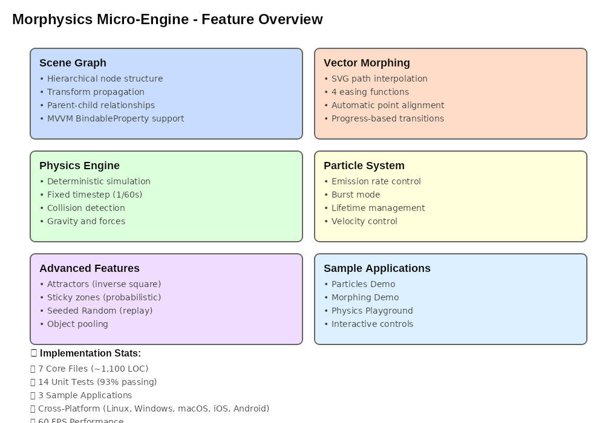
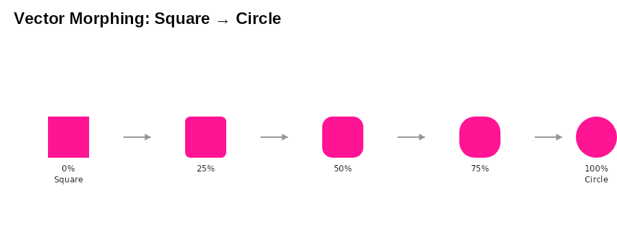
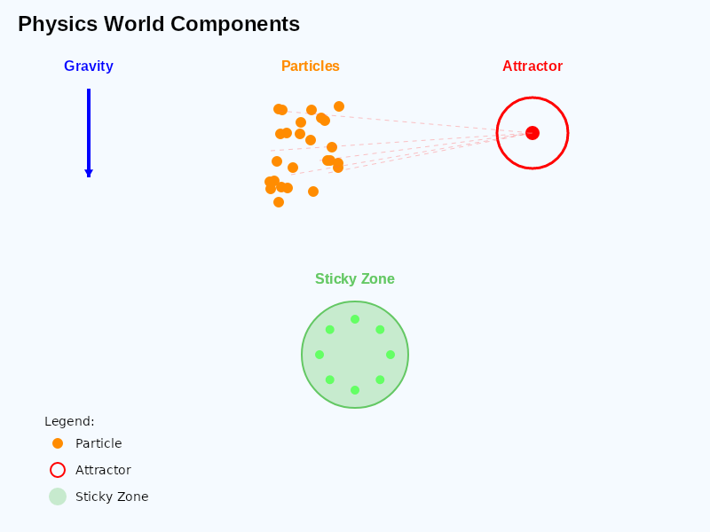
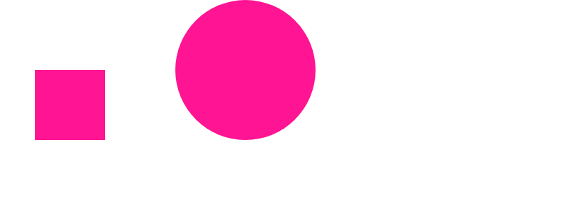
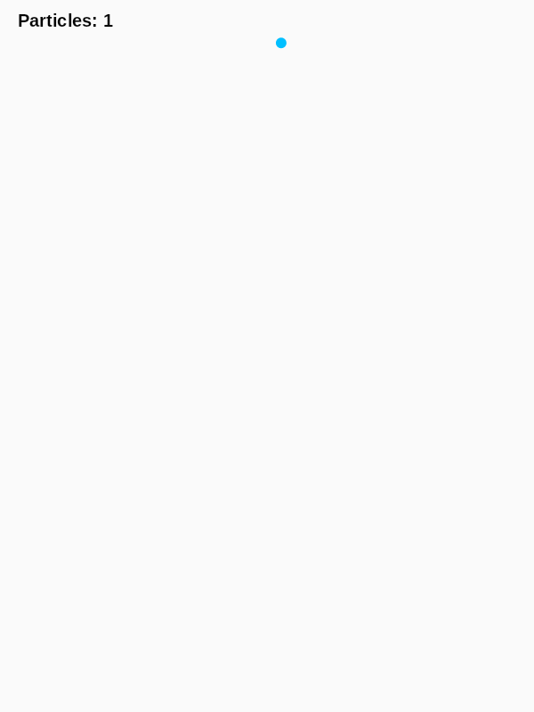
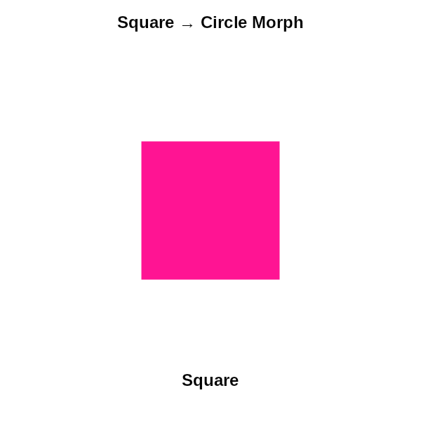
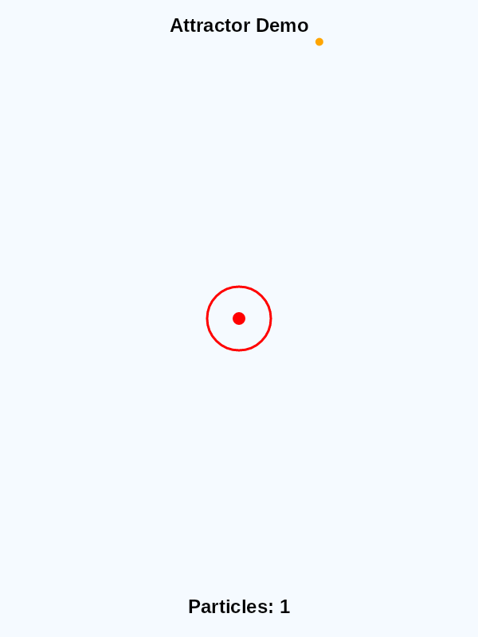

# Morphysics Visual Assets

This directory contains visual documentation for the Morphysics micro-engine.

## Static Images (PNG)

### Feature Overview

**File**: `feature-overview.png` (92KB, 1000x700px)
- Complete feature matrix with 6 components
- Implementation statistics
- Color-coded categories

### Morphing Progression

**File**: `morphing-progression.png` (14KB, 900x350px)
- 5-stage morphing visualization (0%, 25%, 50%, 75%, 100%)
- Square → Circle transformation

### Physics Components

**File**: `physics-components.png` (37KB, 800x600px)
- Gravity vector, particles, attractors, sticky zones
- Force visualization
- Comprehensive legend

### Morphing Demo

**File**: `morphing-demo.png` (5.4KB, 800x300px)
- Simple conceptual illustration

---

## Animated GIFs

### Particles with Gravity

**File**: `gifs/particles-gravity.gif` (190KB, 600x800px, 4 sec @ 20fps)
- Continuous particle emission from top
- Gravity pulling particles down
- Bounce physics on bottom and sides
- Real-time particle counter
- Demonstrates: Physics simulation, collision detection, restitution

### Vector Morphing Animation

**File**: `gifs/morphing-square-circle.gif` (240KB, 600x600px, 6 sec @ 20fps)
- Square morphing to circle and back
- Smooth easing (EaseInOut)
- Progress indicator showing percentage
- Demonstrates: Path interpolation, easing functions

### Attractor Demonstration

**File**: `gifs/attractor-demo.gif` (413KB, 600x800px, 6 sec @ 20fps)
- Particles spawning from top
- Red attractor at center pulling particles
- Particles disappear when reaching attractor
- Real-time particle counter
- Demonstrates: Attractor forces, inverse square law, particle lifecycle

---

## File Summary

**Static Images (4)**: 148KB total
- feature-overview.png (92KB)
- physics-components.png (37KB)
- morphing-progression.png (14KB)
- morphing-demo.png (5.4KB)

**Animated GIFs (3)**: 843KB total
- attractor-demo.gif (413KB, 6 sec)
- morphing-square-circle.gif (240KB, 6 sec)
- particles-gravity.gif (190KB, 4 sec)

**Total**: 991KB (7 files)

---

## Generation

All images and GIFs are generated programmatically using:
- **Tool**: `samples/MorphysicsImageGenerator/`
- **Static Images**: `dotnet run --project MorphysicsImageGenerator.csproj`
- **Animated GIFs**: `dotnet run --project MorphysicsGifGenerator.csproj`

### Requirements
- .NET 9 SDK
- SkiaSharp 3.119.1
- SkiaSharp.NativeAssets.Linux (on Linux)
- SixLabors.ImageSharp 3.1.6 (for GIFs)

---

*All assets generated programmatically for consistency and reproducibility*
