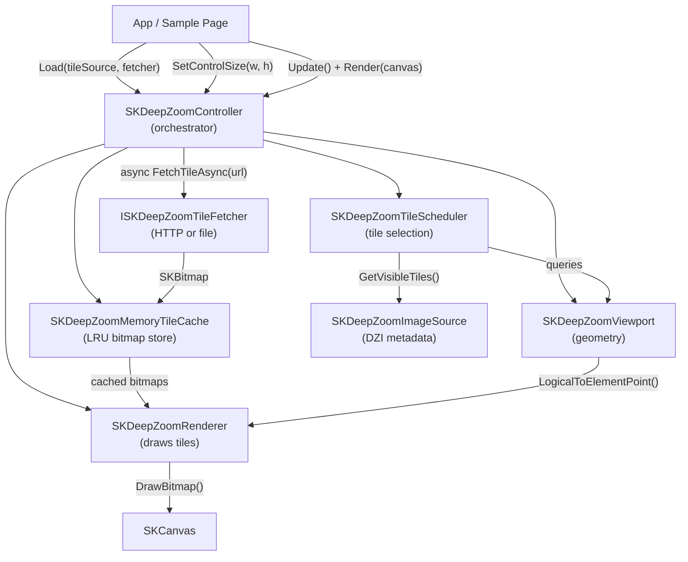
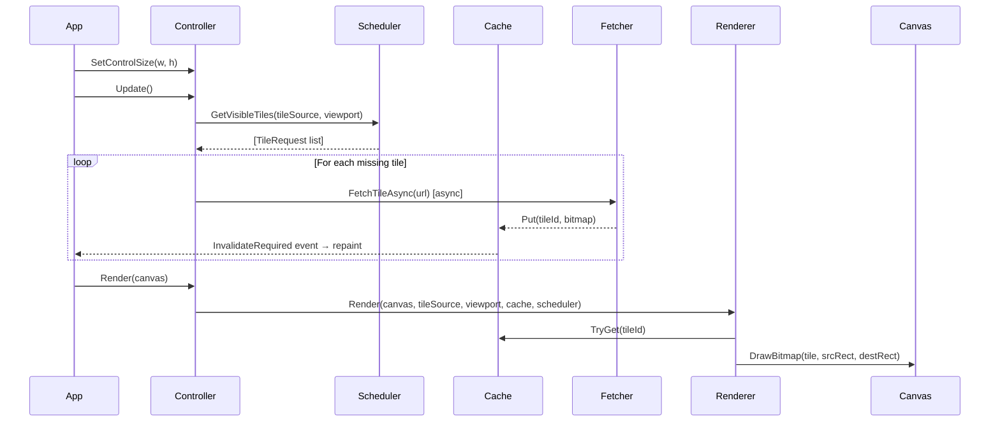
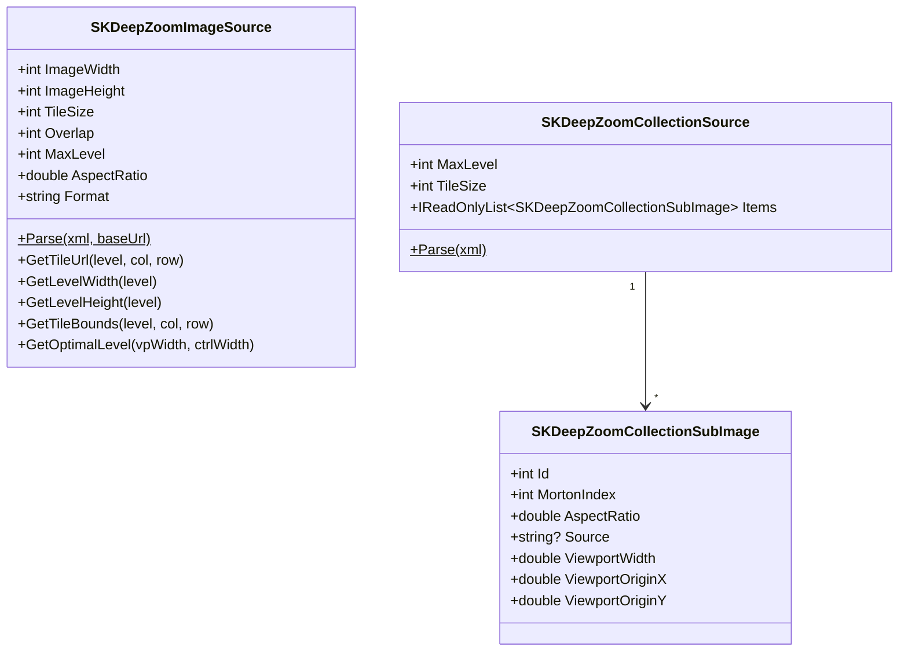
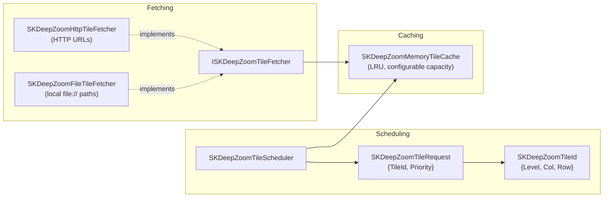
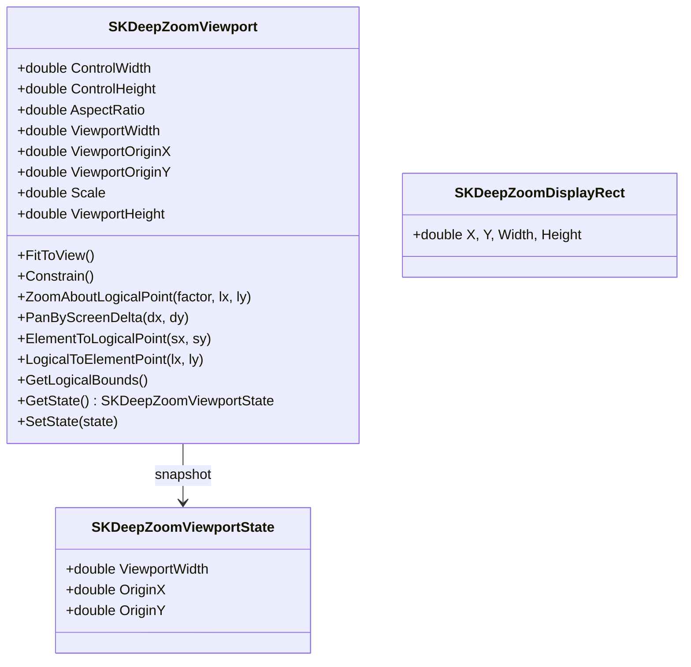
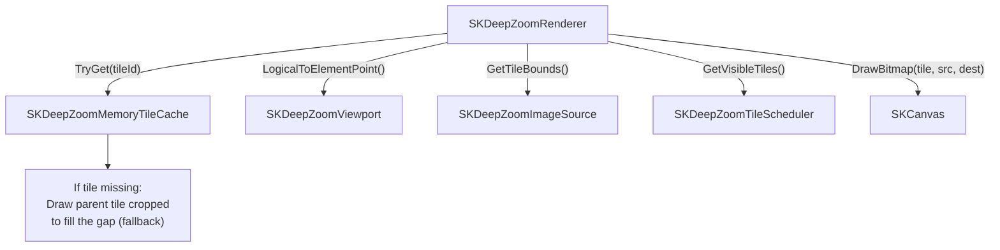
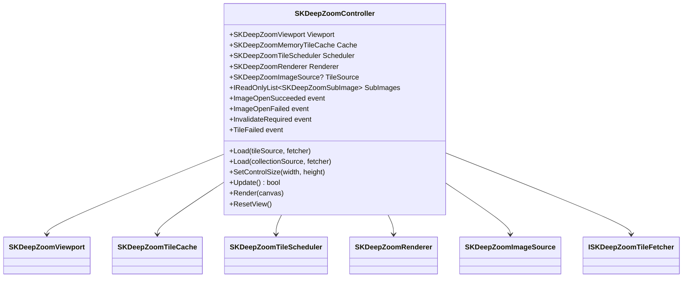

# SkiaSharp.Extended DeepZoom

A static rendering system for Deep Zoom images (DZI) and collections (DZC). Loads tiled pyramid images at the optimal resolution for the current canvas size, rendering them centered-fit onto any `SKCanvas`.

---

## What is Deep Zoom?

Deep Zoom is a tiled image pyramid protocol originally from Silverlight's `MultiScaleImage`. An image at any resolution is sliced into tiles at multiple zoom levels, so viewers download only the tiles visible at the current zoom — not the full gigapixel image.

Two file formats are supported:

| Format | Description |
|--------|-------------|
| `.dzi` | **Deep Zoom Image** — a single image pyramid |
| `.dzc` | **Deep Zoom Collection** — a composite of many images |

---

## Architecture Overview



### Typical call sequence (per frame)



---

## Subsystem Breakdown

### 1 — Source Parsing (DZI / DZC)

Parses the XML descriptor and computes tile URLs, level dimensions, and tile bounds.



### 2 — Tile Infrastructure

The tile pipeline handles fetching, deduplication, caching, and scheduling.



**`SKDeepZoomTileId`** — uniquely identifies a tile as `(level, col, row)`.  
**`SKDeepZoomTileRequest`** — adds fallback context: if the exact tile isn't cached, a parent tile at a lower level is used to fill the space while the tile loads.  
**`SKDeepZoomMemoryTileCache`** — thread-safe LRU cache of `SKBitmap` objects. Evicts least-recently-used tiles when capacity is reached.

### 3 — Viewport & Geometry

Translates between screen space and the normalized logical space (`0..1` horizontally) used by DeepZoom.



**Logical space**: `X=0` is the left edge of the image, `X=1` is the right edge. `Y` is scaled proportionally (height = `1/AspectRatio`).

**`FitToView()`** handles any combination of view and image aspect ratios:
- Wide image + tall view → fits width, centers vertically
- Tall image + wide view → fits height, centers horizontally
- `SetControlSize(w, h)` automatically refits when the canvas is resized.

### 4 — Rendering



The renderer always falls back to a lower-level tile while the correct tile is loading, so the display is never blank. Tile borders and a debug overlay can be enabled via `ShowTileBorders`.

---

## Component Relationships (full picture)



---

## Quick Start

### Blazor (WebAssembly)

```razor
@page "/viewer"
@using SkiaSharp.Extended.DeepZoom
@implements IDisposable

<SKGLView @ref="_canvas" OnPaintSurface="OnPaint"
          style="width: 100%; height: 600px;" />

@code {
    private SKGLView? _canvas;
    private readonly SKDeepZoomController _controller = new();

    protected override async Task OnAfterRenderAsync(bool firstRender)
    {
        if (!firstRender) return;
        _controller.InvalidateRequired += (_, _) => InvokeAsync(() => _canvas?.Invalidate());

        var xml = await Http.GetStringAsync("https://example.com/image.dzi");
        var src = SKDeepZoomImageSource.Parse(xml, "https://example.com/image_files/");
        _controller.Load(src, new SKDeepZoomHttpTileFetcher(new HttpClient()));
    }

    private void OnPaint(SKPaintGLSurfaceEventArgs e)
    {
        _controller.SetControlSize(e.BackendRenderTarget.Width, e.BackendRenderTarget.Height);
        _controller.Update();
        _controller.Render(e.Surface.Canvas);
    }

    public void Dispose() => _controller.Dispose();
}
```

### MAUI

```csharp
public partial class MyPage : ContentPage
{
    private readonly SKDeepZoomController _controller = new();

    protected override async void OnAppearing()
    {
        base.OnAppearing();
        _controller.InvalidateRequired += (_, _) => canvas.InvalidateSurface();

        using var stream = await FileSystem.OpenAppPackageFileAsync("image.dzi");
        var xml = await new StreamReader(stream).ReadToEndAsync();
        var src = SKDeepZoomImageSource.Parse(xml, "image_files/");
        _controller.Load(src, new AppPackageFetcher());
    }

    private void OnPaintSurface(object? s, SKPaintSurfaceEventArgs e)
    {
        _controller.SetControlSize(e.Info.Width, e.Info.Height);
        _controller.Update();
        _controller.Render(e.Surface.Canvas);
    }

    protected override void OnDisappearing()
    {
        base.OnDisappearing();
        _controller.Dispose();
    }
}
```

---

## File Reference

| File | Purpose |
|------|---------|
| `SKDeepZoomController.cs` | Top-level orchestrator — load, resize, update, render |
| `SKDeepZoomViewport.cs` | Logical↔screen coordinate transforms, centered-fit math |
| `SKDeepZoomViewportState.cs` | Snapshot struct for viewport state |
| `SKDeepZoomRenderer.cs` | Draws tiles onto `SKCanvas` with fallback support |
| `SKDeepZoomTileScheduler.cs` | Selects visible tiles at the optimal pyramid level |
| `SKDeepZoomMemoryTileCache.cs` | Thread-safe LRU cache of decoded tile bitmaps |
| `SKDeepZoomTileId.cs` | Identifies a tile: `(level, col, row)` |
| `SKDeepZoomTileRequest.cs` | Tile + optional fallback parent tile |
| `SKDeepZoomTileFailedEventArgs.cs` | Event args for tile load failures |
| `SKDeepZoomImageSource.cs` | Parses `.dzi` XML; computes tile URLs and level dims |
| `SKDeepZoomCollectionSource.cs` | Parses `.dzc` XML; contains sub-image metadata |
| `SKDeepZoomCollectionSubImage.cs` | Sub-image entry in a DZC collection |
| `SKDeepZoomSubImage.cs` | Runtime sub-image view with viewport positioning |
| `SKDeepZoomDisplayRect.cs` | Logical display rectangle helper |
| `ISKDeepZoomTileFetcher.cs` | Interface for tile fetching |
| `SKDeepZoomHttpTileFetcher.cs` | HTTP tile fetcher (`HttpClient`-based) |
| `SKDeepZoomFileTileFetcher.cs` | Local file tile fetcher |
